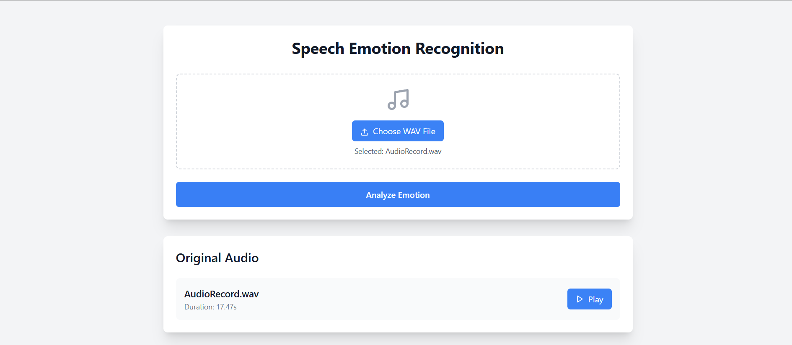
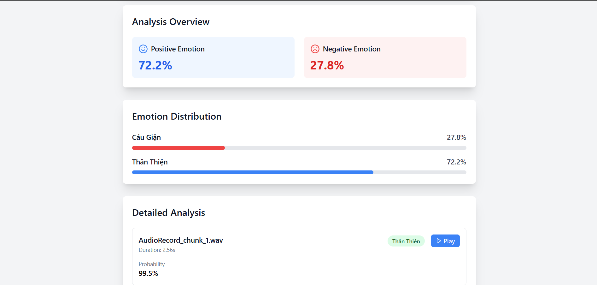

# Speech Emotion Recognition UI

A modern web application for analyzing emotions in speech using machine learning. This application provides a user-friendly interface to upload audio files and get detailed emotion analysis results.

## Features

- **Audio File Upload**: Support for WAV format audio files
- **Real-time Analysis**: Quick processing and analysis of speech emotions
- **Detailed Results**:
  - Overall emotion distribution
  - Positive/Negative emotion percentages
  - Detailed analysis of each audio chunk
  - Audio playback functionality for both original and processed chunks
- **Modern UI**: Built with React and Tailwind CSS
- **Responsive Design**: Works on both desktop and mobile devices

## UI Screenshots

### Main Interface



### Analysis Results



## Emotion Categories

The system recognizes the following emotions:

- **Positive Emotions**:
  - Friendly (Thân Thiện)
  - Happy (Vui Vẻ)
- **Negative Emotions**:
  - Angry (Cáu Giận)
  - Cold (Lạnh Lùng)
  - Tired (Mệt Mỏi)

## Technical Stack

### Frontend

- React.js
- Tailwind CSS
- React Icons
- HTML5 Audio API

### Backend

- FastAPI (Python)
- Librosa (Audio processing)
- Keras (Machine Learning model)
- Pydub (Audio segmentation)

## Getting Started

### Prerequisites

- Node.js (v14 or higher)
- Python 3.8 or higher
- npm or yarn

### Installation

1. Clone the repository:

```bash
git clone [repository-url]
cd Speech-Emotion-Recognition-UI
```

2. Install frontend dependencies:

```bash
npm install
```

3. Install backend dependencies:

```bash
pip install -r requirements.txt
```

### Running the Application

1. Start the backend server:

```bash
uvicorn main:app --host 0.0.0.0 --port 8386
```

2. Start the proxy server:

```bash
node server.js
```

3. Start the frontend development server:

```bash
npm start
```

4. Open your browser and navigate to `http://localhost:3000`

## Usage

1. Click "Choose WAV File" to select an audio file
2. Click "Analyze Emotion" to process the file
3. View the analysis results:
   - Overall emotion distribution
   - Positive/Negative emotion percentages
   - Detailed analysis of each audio chunk
4. Use the play buttons to listen to:
   - Original audio file
   - Individual emotion chunks

## API Endpoints

- `POST /predict-emotion/`: Upload and analyze audio file
- `GET /audio/{filename}`: Access audio files

## Response Format

The API returns a JSON object with the following structure:

```json
{
  "original_file": "filename.wav",
  "original_duration": 17.472,
  "original_file_path": "/audio/filename.wav",
  "predictions_details": [
    {
      "file": "filename_chunk_1.wav",
      "file_path": "/audio/processed/filename_chunk_1.wav",
      "emotion": "Friendly",
      "duration": 2.56,
      "probability": 99.54,
      "probability_positive": 99.55,
      "probability_negative": 0.45
    }
  ],
  "emotion_percentages": {
    "Angry": 27.78,
    "Friendly": 72.22
  },
  "overview_percentage": {
    "positive_percentage": 72.22,
    "negative_percentage": 27.78
  }
}
```

## Acknowledgments

- The machine learning model is trained on a custom dataset
- Audio processing powered by Librosa
- UI components styled with Tailwind CSS
